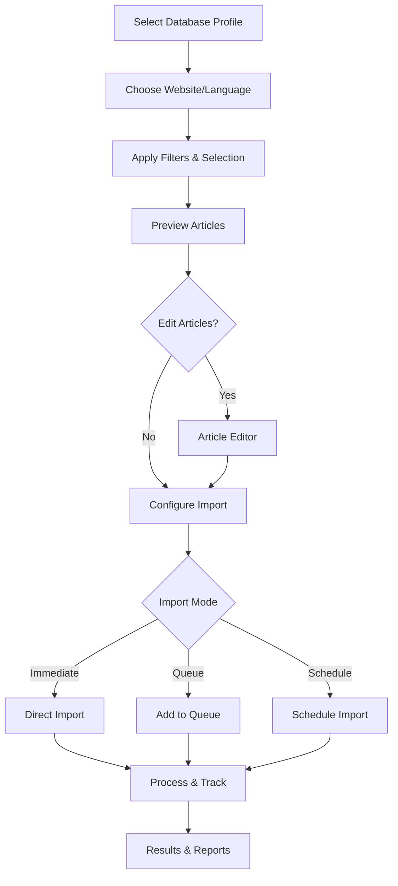

# Enhanced Content Database to Payload CMS Migration System v2.0

A comprehensive article selection and import system that allows you to choose databases, filter articles, preview content, and manage imports with full control over the migration process.

## 🚀 Quick Start

### Installation

```bash
cd golfer
pnpm install
```

### Basic Usage

```bash
# Interactive mode - easiest way to get started
pnpm tsx scripts/content-db-migration/easy-import.ts interactive

# Quick import from specific database
pnpm tsx scripts/content-db-migration/easy-import.ts quick --database content_creation_db --website 1 --language ja

# List available databases
pnpm tsx scripts/content-db-migration/easy-import.ts list-databases

# Test database connection
pnpm tsx scripts/content-db-migration/easy-import.ts test content_creation_db

# View database statistics
pnpm tsx scripts/content-db-migration/easy-import.ts stats content_creation_db
```

## 📁 Database Configuration

### Multiple Database Support

Configure multiple databases in `database-profiles.json`:

```json
{
  "profiles": {
    "content_creation_db": {
      "name": "Content Creation Database",
      "connection": {
        "host": "localhost",
        "port": 5432,
        "database": "content_creation_db",
        "user": "postgres",
        "password": "2801"
      },
      "tables": {
        "articles": "articles",
        "categories": "categories"
      },
      "fieldMappings": {
        "id": "id",
        "title": "title",
        "content": "content",
        ...
      }
    },
    "blog_database": {
      ...
    }
  }
}
```

### Adding New Databases

1. Edit `database-profiles.json`
2. Add your database profile with connection details
3. Map your database fields to the standard format
4. Test connection: `pnpm tsx scripts/content-db-migration/easy-import.ts test your_database`

## 🎯 Article Selection Features

### Interactive Selection Mode

The enhanced system provides multiple ways to select articles:

1. **Select All** - Import all articles from the database
2. **Filter Mode** - Apply multiple filters simultaneously
3. **Date Range** - Select articles within a specific date range
4. **Category Selection** - Choose specific categories
5. **Custom Selection** - Manually pick individual articles

### Advanced Filtering

```typescript
// Available filters
- Search text (title & content)
- Categories (multiple selection)
- Authors (multiple selection)
- Language filtering
- Status (draft/published)
- Has images (yes/no)
- Word count range
- SEO completeness
```

### Selection Presets

Save and reuse your selection criteria:

```bash
# Save current selection as preset
# Automatically prompted in interactive mode

# Presets stored in selection-presets.json
# Can be loaded for future imports
```

## 📦 Import Queue System

### Queue Management

The import queue system allows you to:
- **Create named queues** for batch processing
- **Schedule imports** for specific times
- **Set up recurring imports** (hourly, daily, weekly, monthly)
- **Pause/resume** processing
- **Retry failed imports** automatically
- **Track progress** with real-time updates

### Queue Features

```javascript
// Queue configuration
{
  batchSize: 10,           // Articles per batch
  maxRetries: 3,           // Retry attempts for failures
  pauseOnError: false,     // Continue on errors
  skipDuplicates: true,    // Skip existing articles
  autoMapping: true,       // Auto-map categories
  notifyOnComplete: true   // Show completion notification
}
```

### Queue Operations

```bash
# Queue management in interactive mode
- Add articles to queue
- Start/pause/resume processing
- View queue statistics
- Export queue data
- Schedule recurring imports
```

## Features

### Content Conversion
- **Markdown → Lexical** - Automatic conversion of markdown content
- **HTML → Lexical** - Handles HTML content
- **JSON Lexical** - Preserves existing Lexical JSON format
- **Rich Media** - Converts images, tables, code blocks
- **Mermaid Diagrams** - Detects and creates Mermaid blocks

### Language Support
- **Multi-language** - Handles different languages per website
- **RTL Support** - Automatic RTL detection for Arabic/Hebrew
- **Japanese Formatting** - Special handling for Japanese content

### Data Mapping
- **Categories** - Map content DB categories to Payload taxonomy
- **Authors** - Map authors to Payload users
- **Tags** - Automatic tag creation and assignment
- **Status** - Map publish status (draft/published)
- **Metadata** - Preserves SEO metadata and dates

### Duplicate Prevention
- **Smart Detection** - Checks by original ID and slug
- **Update Existing** - Updates instead of creating duplicates
- **Tracking** - Stores original database references

### Progress Tracking
- **Real-time Updates** - Shows progress during migration
- **Error Reporting** - Detailed error messages
- **Result Summary** - Success/failure statistics
- **JSON Export** - Saves detailed results to file

## Database Schema

Expected content database structure:

```sql
CREATE TABLE articles (
  id SERIAL PRIMARY KEY,
  website_id INTEGER NOT NULL,
  language VARCHAR(10) NOT NULL,
  title VARCHAR(255) NOT NULL,
  content TEXT NOT NULL,
  slug VARCHAR(255),
  meta_description TEXT,
  keywords TEXT,
  category VARCHAR(100),
  tags TEXT[], -- Array of tags
  author VARCHAR(100),
  status VARCHAR(20),
  featured_image VARCHAR(500),
  published_at TIMESTAMP,
  created_at TIMESTAMP DEFAULT NOW(),
  updated_at TIMESTAMP DEFAULT NOW()
);
```

## 🔄 Migration Workflow



## 🎨 Article Operations

### Individual Article Actions
- **Preview** - See how article looks in Lexical format
- **Edit** - Modify content before import
- **Duplicate** - Create variations
- **Skip** - Exclude from import
- **Add Tags** - Enhance metadata

### Bulk Operations
- Change categories for multiple articles
- Update author information
- Set publish dates
- Apply content transformations
- Export selected articles

## Error Handling

The migration tool handles:
- Database connection failures
- Invalid content formats
- Missing categories/tags
- Network timeouts
- Payload API errors

All errors are logged with details and saved in the results file.

## Results File

Migration results are saved as JSON:

```json
{
  "successful": [
    {
      "success": true,
      "articleId": 123,
      "payloadId": "abc-def-ghi",
      "title": "Article Title"
    }
  ],
  "failed": [
    {
      "success": false,
      "articleId": 456,
      "title": "Failed Article",
      "error": "Error message"
    }
  ],
  "summary": {
    "total": 100,
    "succeeded": 95,
    "failed": 5,
    "duration": 45.2
  }
}
```

## 📖 CLI Commands Reference

### Database Commands
```bash
# List all database profiles
pnpm tsx scripts/content-db-migration/easy-import.ts list-databases

# Test database connection
pnpm tsx scripts/content-db-migration/easy-import.ts test <database-name>

# Show database statistics
pnpm tsx scripts/content-db-migration/easy-import.ts stats <database-name>
```

### Import Commands
```bash
# Interactive mode (recommended for first-time users)
pnpm tsx scripts/content-db-migration/easy-import.ts interactive

# Quick import with options
pnpm tsx scripts/content-db-migration/easy-import.ts quick \
  --database content_creation_db \
  --website 1 \
  --language ja \
  --category golf \
  --limit 50 \
  --dry-run

# Legacy simple import (backward compatible)
pnpm tsx scripts/content-db-migration/migrate-articles.ts
```

### Options
- `--database <name>` - Database profile to use
- `--website <id>` - Website ID to filter
- `--language <code>` - Language code (ja, en, etc.)
- `--category <name>` - Filter by category
- `--limit <number>` - Maximum articles to import
- `--dry-run` - Preview without importing

## 🛠️ Troubleshooting

### Connection Issues
- Verify database profile in `database-profiles.json`
- Check PostgreSQL is running
- Test connection: `pnpm tsx scripts/content-db-migration/easy-import.ts test <database>`

### Content Conversion
- Check content format (Markdown/HTML/JSON)
- Verify special characters are properly encoded
- Review field mappings in database profile

### Import Failures
- Check error logs in queue system
- Verify Payload CMS is running
- Ensure categories exist in Payload
- Review failed items in results JSON

### Performance
- Adjust `batchSize` in queue settings
- Use filtering to reduce dataset size
- Schedule imports during low-traffic periods

## 📚 Advanced Usage

### Custom Database Profiles
Create custom profiles for different database structures by editing `database-profiles.json` and mapping your fields to the standard format.

### Programmatic Access
```javascript
import { ArticleSelectionManager } from './article-selection-manager';
import { ImportQueueManager } from './import-queue-system';

// Create selection manager
const manager = new ArticleSelectionManager('content_creation_db');
await manager.loadArticles(websiteId, language);

// Apply filters
manager.setFilter('categories', ['golf', 'sports']);
manager.selectAll();

// Get selected articles
const articles = manager.getSelectedArticles();

// Create import queue
const queueManager = new ImportQueueManager();
const queue = queueManager.createQueue('My Import', articles, config);

// Start processing
await queueManager.startQueue(queue.id);
```

## 📝 Notes

- All imports preserve original article IDs for tracking
- Duplicate detection prevents re-importing existing content
- Failed imports can be retried automatically
- Queue system persists between sessions
- Selection presets are saved for reuse
- Results are exported to timestamped JSON files